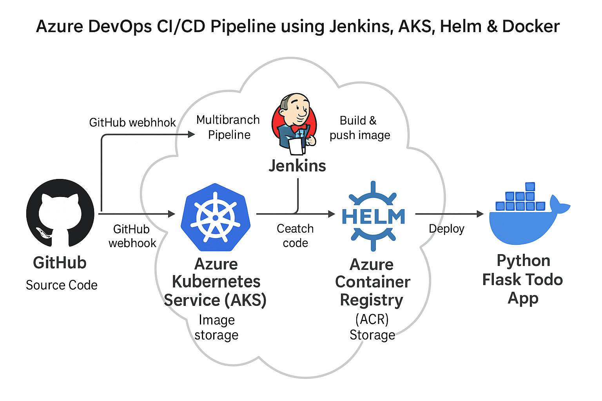

# Azure DevOps CI/CD Pipeline using Jenkins (CI), ArgoCD (CD), AKS, Helm & Docker
A complete end-to-end DevOps project implementing CI/CD & GitOps on Azure using 
**Jenkins for Continuous Integration**, **ArgoCD for Continuous Delivery**, 
**AKS for container orchestration**, **ACR for container image storage**, 
**Helm for deployments**, and **Docker for containerization**.


---

## 📌 Overview

This project builds a fully automated CI/CD pipeline using:

- **Azure Kubernetes Service (AKS)**
- **Jenkins (CI)**
- **Azure Container Registry (ACR)**
- **Docker**
- **Helm**
- **ArgoCD (GitOps CD)**
- **Python Flask Todo App**

The pipeline:

1. Jenkins pulls latest code  
2. Builds Docker image using `az acr build`  
3. Pushes image to ACR  
4. Jenkins updates Helm chart with new tag  
5. Jenkins commits updated Helm chart to GitHub  
6. **ArgoCD auto-syncs & deploys to AKS** 

---

## 🧩 Architecture



## Setup Steps

1. **Create Azure Resource Group**
    ```
    az group create -n <RG_NAME> -l <LOCATION>
    ```

2. **Create Azure Container Registry (ACR)**
    ```
    az acr create -g <RG_NAME> -n <ACR_NAME> --sku Basic --admin-enabled false
    ```

3. **Create AKS Cluster**
    ```
    az aks create
    --resource-group <RG_NAME>
    --name <AKS_NAME>
    --node-count 1
    --node-vm-size Standard_DS2_v2
    --enable-managed-identity
    --generate-ssh-keys
    ```

4. **Connect kubectl to AKS**
    ```
    az aks get-credentials -g <RG_NAME> -n <AKS_NAME>
    ```

5. **Install Jenkins using Helm**
    ```
    helm repo add jenkinsci https://charts.jenkins.io
    helm repo update
    kubectl create namespace jenkins
    
    helm install jenkins jenkinsci/jenkins -n jenkins
    --set controller.serviceType=LoadBalancer
    --set persistence.enabled=false
    --set controller.resources.requests.cpu=100m
    --set controller.resources.requests.memory=256Mi
    --set controller.resources.limits.cpu=500m
    --set controller.resources.limits.memory=512Mi
    ```


6. **Retrieve Jenkins admin password**
    ```
    kubectl exec -it -n jenkins jenkins-0 -- cat /run/secrets/chart-admin-password
    ```


7. **Get Jenkins Load Balancer URL**
    ```
    kubectl get svc -n jenkins
    ```

Open the external IP in a browser to access Jenkins.

8. **Configure Jenkins Pipeline**

- Install required plugins (Git, Docker Pipeline, GitHub Branch Source, Credentials Binding, Pipeline)
- Add GitHub PAT credentials (`git-creds`)
- Add Azure SP JSON credentials (`AZURE_AUTH`)
- Create a **Multibranch Pipeline**
- Set repository URL and Jenkinsfile path:
  ```
  jenkins/Jenkinsfile
  ```
- Add GitHub Webhook:
  ```
  https://<jenkins-url>/github-webhook/
  ```

9. **ArgoCD Setup (CD Layer)**

Install ArgoCD:
  ```
  kubectl create namespace argocd
  
  kubectl apply -n argocd -f \
  https://raw.githubusercontent.com/argoproj/argo-cd/stable/manifests/install.yaml
  ```
Get ArgoCD Initial Password:

  ```
  kubectl -n argocd get secret argocd-initial-admin-secret -o jsonpath="{.data.password}" | base64 --decode

  ```
Expose ArgoCD UI (NodePort for free tier):
  ```
  kubectl patch svc argocd-server -n argocd  -p '{"spec": {"type": "NodePort"}}'
  ```
Access ArgoCD: 
```
http://<NODE-IP>:<NODEPORT>
```
Configure ArgoCD App:
ArgoCD watches the Helm chart folder: /helm/todo-app
Whenever Jenkins updates values.yaml, ArgoCD automatically deploys the new release to AKS.

## 🧪 CI/CD Flow Summary
✔ Jenkins handles CI:
- Checkout code  
- Build container image using `az acr build`  
- Update Helm chart with new image tag  
- Commit updated chart back to GitHub  

✔ ArgoCD handles CD:
- Detect Helm update
- Sync to cluster
- Deploy new version


10. **Access Your Application**

 ```
 kubectl get svc
 ```

 Open the external IP of your application service in a browser.

11. **Delete All Azure Resources (Prevent Billing)**

 ```
 az group delete -n <RG_NAME> --yes --force-deletion
 ```

---

## Skills Demonstrated

This project demonstrates practical hands-on skills across Azure Cloud, DevOps, Containers, and GitOps workflows:

- **Azure Kubernetes Service (AKS)** – Provisioning and managing managed Kubernetes clusters  
- **Azure Container Registry (ACR)** – Secure container storage and cloud-native image builds using `az acr build`  
- **Azure IAM & Service Principals** – Role-Based Access Control (RBAC), SP authentication for CI tools  
- **Kubernetes (K8s)** – Deployments, Services, ConfigMaps, Namespaces, RBAC, autosync deployments  
- **Helm** – Packaging, templating, image versioning, and automated updates via CI  
- **Jenkins (CI)** – Multibranch pipelines, GitHub webhooks, secure credential management, CI automation  
- **ArgoCD (CD / GitOps)** – GitOps-based continuous delivery, automatic sync and rollout to AKS  
- **Docker** – Containerizing applications, multi-stage builds, optimizing images  
- **GitHub** – Repository structuring, branching workflow, PAT integration, webhooks  
- **GitOps Workflow** – Jenkins updates Helm → commits to Git → ArgoCD auto-deploys to AKS  
- **Cloud Networking** – LoadBalancers, ingress access, NodePort services, cluster networking basics  
- **Observability & Debugging** – Kubernetes logs, pod events, Jenkins build logs, real-time troubleshooting  
- **Scripting & Automation** – Shell scripting, repeatable cluster setup, cleanup automation  
 

## Challenges Faced & Solutions

1. ACR Creation Failed
**Problem:** Subscription not registered for ACR.  
**Solution:** Registered provider using:
  ```
  az provider register --namespace Microsoft.ContainerRegistry
  ```

2. AKS VM Size Not Allowed
**Problem:** Free tier didn't support Standard_B2s.  
**Solution:** Switched to a supported size like `Standard_DS2_v2`.

3. Jenkins Init Container Crash
**Problem:** Low memory on free-tier AKS nodes.  
**Solution:** Reduced Jenkins resource limits and disabled persistence.

4. Docker Agent Not Supported in Jenkins
**Problem:** Jenkins `agent docker {}` failed on Kubernetes.  
**Solution:** Used `az acr build` instead of Docker inside Jenkins.

5. Python Missing in Jenkins Pod
**Problem:** Tests couldn't run inside Jenkins container.  
**Solution:** Moved testing into the Docker/ACR build step.

6. Multibranch Pipeline Had No "Build Now"
**Problem:** Users expected manual trigger.  
**Solution:** Used “Scan Repository Now” or triggered via GitHub commits.


## Conclusion

This project implements a complete, production-grade DevOps pipeline using:

- Jenkins for CI
- ArgoCD for GitOps-based CD
- AKS for orchestration
- ACR for image storage
- Helm for deployments
- Docker for containerization
